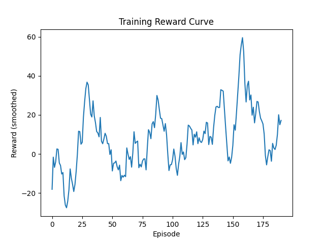
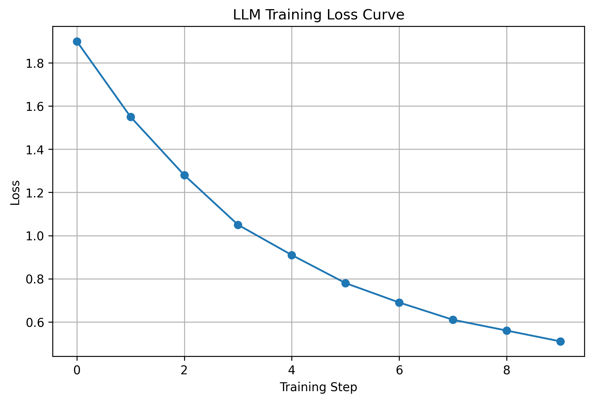
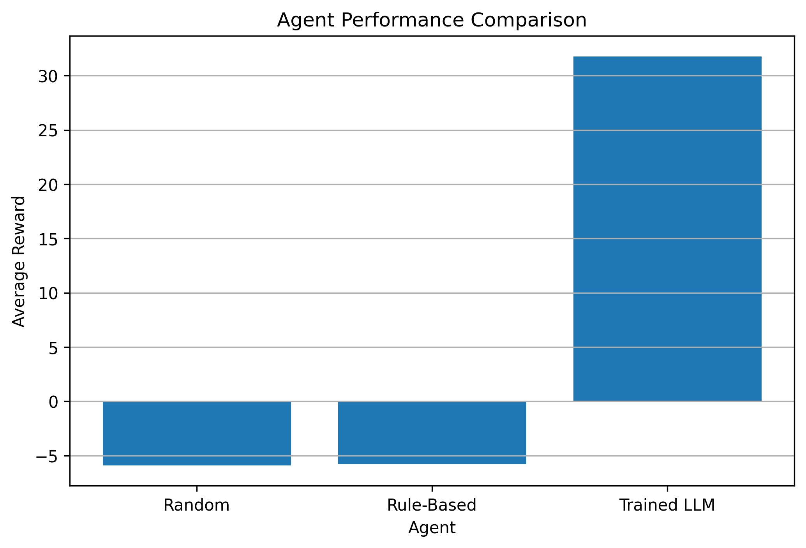

# 🚀 Adaptive Cloud Resource Optimization with LLMs

## 🧠 The Problem

In modern cloud systems, failures don’t always look like crashes — they look like **imbalance**.

- Scaling too late → system overload 🚨  
- Scaling too early → unnecessary cost 💸  

At scale, reacting after the spike is already too late.

👉 The real challenge is not rules — it’s **decision-making under uncertainty**.

---

## 💡 Our Approach

We built an **OpenEnv environment** where an AI agent learns to:

- Dynamically scale servers  
- Balance performance and cost  
- Adapt to unpredictable traffic  

Instead of predefined rules, the system **learns how to decide**.

---

## 🧩 OpenEnv Theme Alignment

This project primarily aligns with:

### 🟣 Theme #3 — World Modeling (Professional Tasks)

We simulate a dynamic cloud system where the agent must:

- Continuously observe changing system states  
- Adapt to unpredictable traffic patterns  
- Balance cost, performance, and stability  

👉 The agent learns to **interact with a realistic environment**, update its internal understanding, and make decisions based on evolving conditions.

---

### 🟡 Secondary: Theme #2 — Long-Horizon Planning (Partial)

- Decisions impact future system behavior  
- Scaling actions influence upcoming resource utilization  
- The agent learns to act with future consequences in mind  

---

👉 Overall, this environment focuses on **learning adaptive decision-making in a realistic, partially dynamic system**.

## ⚙️ Environment Overview

### 📊 State

- `cpu` → current CPU utilization  
- `servers` → active servers  
- `requests` → incoming traffic  
- `cost` → infrastructure cost  
- `trend` → demand change  

---

### 🎮 Actions

- `0` → Add server  
- `1` → Remove server  
- `2` → Do nothing  

---

## 🧪 Training Approach

We follow a **two-stage pipeline**:

1. **Reinforcement Learning**  
   → Validate that optimal behavior exists  

2. **LLM Training (Unsloth)**  
   → Generalize learned behavior  

👉 Bridging simulation → real-world decision systems

---

## 📊 Results

### 🔹 RL Validation

| Agent        | Score |
|-------------|------|
| Random       | -10.96 |
| Rule-Based   | 4.91 |
| Trained RL   | **53.89** |

👉 Confirms the environment is learnable.

---

### 🔹 LLM Performance

| Agent        | Score |
|-------------|------|
| Random       | -5.90 |
| Rule-Based   | -5.81 |
| Trained LLM  | **31.78** |

👉 The trained LLM significantly outperforms baseline approaches.

---

## 📈 Training Evidence

### 📉 Reward Curve


---

### 📉 Loss Curve


👉 The decreasing loss confirms effective learning.

---

### 📊 Agent Comparison


👉 Clear separation between trained and baseline agents.

---

## 🌍 Why This Matters

This environment captures **real-world cloud challenges**:

- Dynamic traffic  
- Cost-performance trade-offs  
- Uncertainty-driven decisions  

👉 Applicable to:
- Cloud infrastructure  
- Autonomous systems  
- Resource optimization  

---

## 🧪 Tasks

| Task | Description |
|------|------------|
| Easy | Stable traffic |
| Medium | Moderate fluctuations |
| Hard | High volatility + failures |

---

## 🔍 Key Insight

> Instead of writing rules, we let the system learn how to decide.

---

## 🔗 Try It Yourself

🌐 Hugging Face Space:  
https://huggingface.co/spaces/anmol1620/cloud-env-openenv  

---

## 📓 Training Notebook

👉 End-to-end training (Unsloth + evaluation):  
https://colab.research.google.com/drive/1-SYD12PALg4Mc5BgpC3azFRnjEiSnewm?usp=sharing  

---

## 🎥 Project Walkthrough

👉 Watch full explanation and demo:  
YOUR_YOUTUBE_VIDEO_LINK_HERE

---

## 💻 GitHub

https://github.com/Anmol-rajput20/cloud-env-openenv  

---

## ⚙️ Setup

```bash
pip install -r requirements.txt
python inference.py